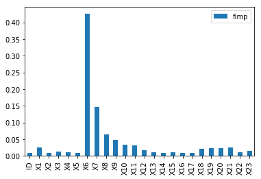
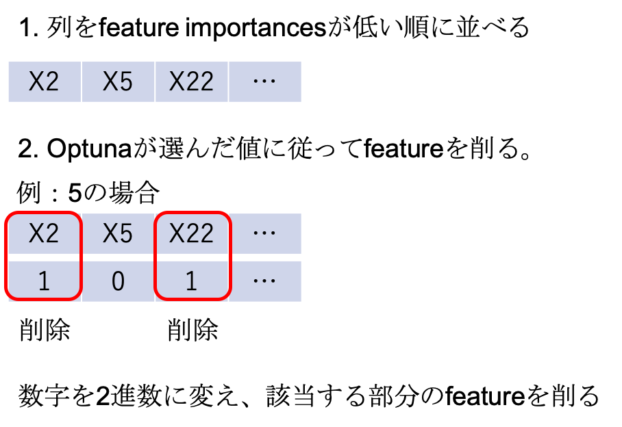

# ProbSpace クレカコンペ 2nd Solution

## はじめに

2019年4〜6月に[probspace](https://prob.space/competitions/credit_default_risk)で行われたコンペの2ndSolutionを残します。

面倒くさいという人は、[`main.py`](https://github.com/nishimoto/probspace_creditcard_public/blob/master/main.py)みてください。

今回は主に、

 - Feature Engineering

 - Feature Selection

 - ほぼ履歴なしの人のkNNによる予測

の3工程で0.839という精度を出すことができました。

（HyperParameterのTuningは試してみたものの、XGBoostのデフォルトパラメーターが最強でした）

## 1. とりあえずXGBoost（Acc: 0.830）

とりあえず汚くてもよいので、精度を出してみます。

```python
import pandas as pd
import xgboost as xgb

# 読み込み
df_train = pd.read_csv("train_data.csv")
df_test = pd.read_csv("test_data.csv")

# なぜかID列がちょっと違う。わざとか?
df_train = df_train.rename(columns={"id": "ID"})

# 前処理
train_y = df_train["y"]
train_x = df_train.drop("y", axis=1)

# 宣言, 学習, 予測
clf = xgb.XGBClassifier()
clf.fit(train_x, train_y)
preds = clf.predict(df_test)

# 出力
result_df = pd.DataFrame()
result_df["ID"] = df_test["ID"]
result_df["Y"] = preds
result_df.to_csv("result.csv", index=False)
```

当初はLightGBMを使用していましたが、この時点でXGBoostの方が精度がよかったのでXGBoostに乗り変えた。

feature_importances（どの列が判別に効いていたかの重要度）を出したところ、以下のようになりました。

 - 入力

```py
# 上のソースコードの続き
%matplotlib inline  # notebookなら必要
fimp_df = pd.DataFrame({
    "fimp": clf.feature_importances_
}, index=train_x.columns)
fimp_df.plot(kind="bar")
```

 - 出力



主にX6（先月支払いができていたか）が大事だということが分かります。

## 2. CrossValScoreの導入

このあとFeature Enginneringなどをするにあたり、手元データで精度を出せないとお話になりません。

[`sklearn.model_selection.cross_val_score`](https://scikit-learn.org/stable/modules/generated/sklearn.model_selection.cross_val_score.html)もありますが、

僕は先人のソースコードを参考にこのコードをコピペして使っています。

```py
import xgboost as xgb
import numpy as np

from sklearn.metrics import accuracy_score
from sklearn.model_selection import StratifiedKFold


def validate(train_x, train_y, params):
    accuracies = []
    feature_importances = []

    cv = StratifiedKFold(n_splits=3, shuffle=True, random_state=0)
    for train_idx, test_idx in cv.split(train_x, train_y):
        trn_x = train_x.iloc[train_idx, :]
        val_x = train_x.iloc[test_idx, :]

        trn_y = train_y.iloc[train_idx]
        val_y = train_y.iloc[test_idx]

        clf = xgb.XGBClassifier(**params)
        clf.fit(trn_x, trn_y)

        pred_y = clf.predict(val_x)
        feature_importances.append(clf.feature_importances_)
        accuracies.append(accuracy_score(val_y, pred_y))
    print(np.mean(accuracies))
    return accuracies, feature_importances
```

## 2. feature engineering（Acc: 0.830 → 0.833）

変数をいろいろ足すことで精度を上げることができます。

今回は、以下の変数を足しています。

基本的に直近のデータ（X6, X12, X18）あたりを割ったりしていました。

 - 請求書の金額の傾き(コード中のa2)
	- [元ネタはKaggleのHomeCreditコンペのSolution](https://github.com/neptune-ml/open-solution-home-credit)より。

 - X12/X13
	- 意味合いとしては上の「請求書の金額の傾き」と同じようなもの。

 - X1/X12
	- 限度額に対しての請求書の金額。借りすぎかどうかの指標

 - X6/X7
	- 意味合いとしては「支払い記録の傾き」。

 - X1/X6
	- 意味合いとしては限度額に対して支払いができているか?
	- なぜ精度があがるかはわからないけど精度あがった笑

また、この辺で一度ハイパーパラメータのチューニングなども試してみましたが、
全然精度あがらなかった記憶があります。

```py
df["X1/X6"] = df["X1"] / df["X6"]
df["X6/X7"] = df["X6"] / df["X7"]
df["X12/X13"] = df["X12"] / df["X13"]
df["X1/X12"] = df["X1"] / df["X12"]
df["X6/X12"] = df["X6"] / df["X12"]

# -2と-1は同じ意味と考え、置換した。
for col in ["X6", "X7", "X8", "X9", "X10", "X11"]:
    df[col] = [-1 if val == -2 else val for val in df[col]]
```

## 3. feature selection（Acc: 0.833 → 0.835）

optunaを使い、以下のような作戦をとりました。



だいたい以下のようなソースコードで動かしていました。

```py
import optuna
import numpy as np
import pandas as pd
import xgboost as xgb
from sklearn.model_selection import cross_val_score


def preprocess_df(df):
    df.drop(["ID", "a1", "b1", "b2", "a3", "b3"], axis=1, inplace=True)
    df.drop(["X5", "X14"], axis=1, inplace=True)
    df["X1/X6"] = df["X1"] / df["X6"]
    df["X6/X7"] = df["X6"] / df["X7"]
    df["X12/X13"] = df["X12"] / df["X13"]
    df["X1/X12"] = df["X1"] / df["X12"]
    df["X6/X12"] = df["X6"] / df["X12"]

    # 値置換 maybe means -2 & -1 same.
    for col in ["X6", "X7", "X8", "X9", "X10", "X11"]:
        df[col] = [-1 if val == -2 else val for val in df[col]]

    df["X6/X7"] = df["X6/X7"].fillna(0)
    df["X12/X13"] = df["X12/X13"].fillna(0)
    df["X6/X12"] = df["X6/X12"].fillna(0)
    return df

def define_delcols(num, features_sorted):
    num_bin_rev_list = list(bin(num).split("0b")[1][::-1])
    for i in range(len(features_sorted) - len(num_bin_rev_list)):
        num_bin_rev_list.append("0")

    delcols = []
    for n, col in zip(num_bin_rev_list, features_sorted):
        if n == "1":
            delcols.append(col)

    return delcols


def feature_selection_byoptuna(trial):
    params = {
        'feature_num': trial.suggest_int('feature_num_int', 0, 512),
    }

    # 数字にしたがってfeatureを落とす
    # feature_numやめておくほうがよいのでは…
    feature_num = params["feature_num"]
    delcols = define_delcols(feature_num, features_sorted)
    print(delcols)
    train_x_selected = train_x.drop(delcols, axis=1)

    return 1 - np.mean(cross_val_score(clf, train_x_selected, train_y))


# features_sortedの取得方法
df_train = pd.read_csv("train_data.csv")
df_test = pd.read_csv("test_data.csv")
df_train, df_test = preprocess_addtrend(df_train, df_test)  # main.py参照

train_y = df_train["y"]
train_x = df_train.drop("y", axis=1)
train_x = train_x.rename(columns={'id': 'ID'})
train_x = preprocess_df(train_x)

clf = xgb.XGBClassifier()
clf.fit(train_x, train_y)

features_sorted = pd.DataFrame({
    "feature_name": train_x.columns,
    "feature_importance": clf.feature_importances_
}).sort_values("feature_importance")["feature_name"].values

study = optuna.create_study()
study.optimize(feature_selection_byoptuna, n_trials=200, n_jobs=1)

```

## 4. 履歴なしの人のkNNによる予測（Acc: 0.835 → 0.839）

リークがないかを探して、完全一致の人を探しているときに、以下のようなデータが結構あることを見つけました。

|id|X1|X2|X3|X4|X5|X6|X7|X8|X9|X10|X11|X12|X13|X14|X15|X16|X17|X18|X19|X20|X21|X22|X23|y|
|-|-|-|-|-|-|-|-|-|-|-|-|-|-|-|-|-|-|-|-|-|-|-|-|-|
|39|210000|1|1|2|29|-2|-2|-2|-2|-2|-2|0|0|0|0|0|0|0|0|0|0|0|0|1|

彼らは、**X6が-2にもかかわらず、default率が3割程度で、X6が-2の人の3倍程度の確率です。**

（下の調査用のコード参照）

そして、 **上記までの予測では、全員を0として予測していることがわかりました。**

 - 調査用のコード

```py
import pandas as pd
df_train = pd.read_csv("train_data.csv")
nohist = "X12 == 0 and X13 == 0 and X14 == 0 and X15 == 0 and X16 == 0 and X17 == 0 and X18 == 0 and X19 == 0 and X20 == 0 and X21 == 0 and X22 == 0 and X23 == 0"
nouse = "X6 == -2 and X7 == -2 and X8 == -2 and X9 == -2 and X10 == -2 and X11 == -2"

df_train_nohist = df_train.query(nohist)
df_train_nouse = df_train_nohist.query(nouse)

# 272人中90人は返済できなかった（yが１)
print(df_train_nouse["y"].sum(), df_train_nouse.shape[0], df_train_nouse["y"].sum() / df_train_nouse.shape[0])

# X6が-2の人は2429人中321人しか返却できていないのに
df_train__2 = df_train.query("X6 == -2")
print(df_train__2["y"].sum(), df_train__2.shape[0], df_train__2["y"].sum() / df_train__2.shape[0])
```

その後、[リークに関する発見](https://prob.space/topics/nishimoto-Postf8a331fb47a070e7b9d6)などもあり、nohist（X12〜X23）が0の人だけでkNNをするのが一番精度がよいということがわかりました。

min-max scaling, n=4でkNNをすると、精度が0.839まで行きました。（parameterはLBにいろいろぶん投げて検証）

```py
def preprocess_knn(df_train, df_test):
    """historyがほぼない人用の前処理関数"""
    # preprocess
    cols = ["X1", "X4", "X5"]

    # z_scoreをするのでdfへconcatしないといけない
    df_train = df_train[cols]
    df_test = df_test[cols]
    df = pd.concat([df_train, df_test])

    len_df_train = len(df_train)
    len_df_test = len(df_test)
    len_df_all = len_df_train + len_df_test

    # min-max scaling +0.003!
    for col in cols:
        df[col] = (df[col] - df[col].min()) / (df[col].max() - df[col].min())

    # subsplit
    df_train = df.iloc[range(len_df_train), :]
    df_test = df.iloc[range(len_df_train, len_df_all), :]

    # return
    return df_train, df_test
```

## おわりに

ここまでに示すように、以下の3工程のみでかなり上位に上り詰めることができました。

 - Feature Engineering

 - Feature Selection

 - ほぼ履歴なしの人のkNNによる予測

この[データの周期性](https://prob.space/topics/hiroki-Post79e31b01543db52d5c2e)に気がついていたら、もうちょっと精度よくできた気もします。

それでは。
